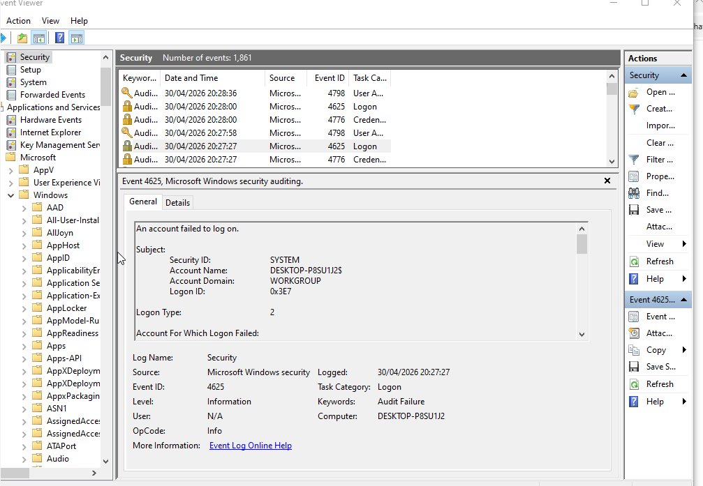
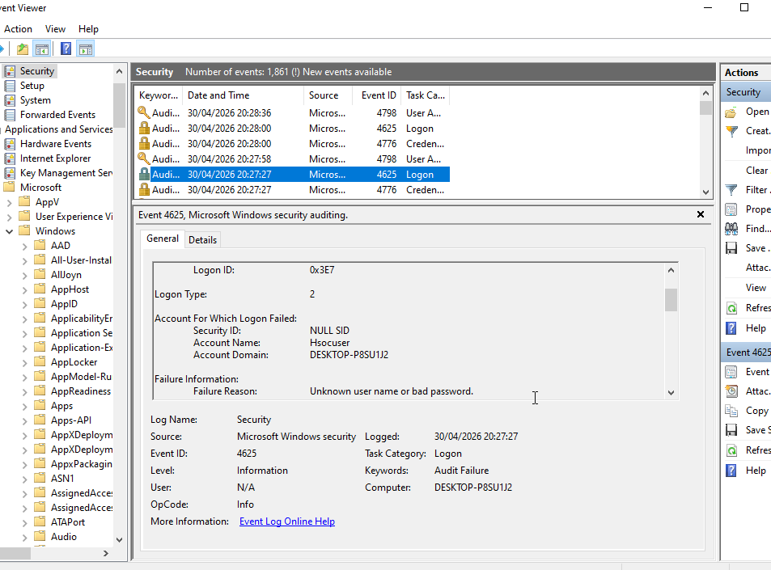
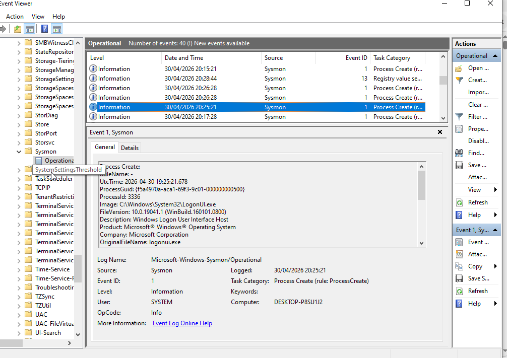
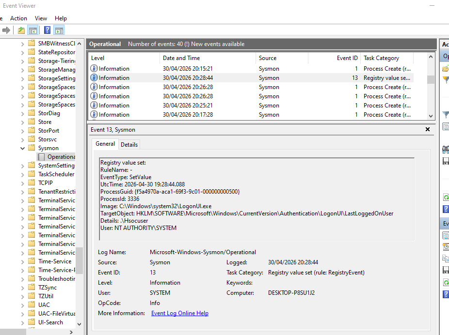

# Brute Force Detection Lab (Windows + Sysmon)

## Overview
This project was a simple lab to simulate failed login attempts on a Windows virtual machine and observe how they appear in logs. I used Windows Event Viewer and Sysmon to look at authentication activity and related system behaviour.

## Environment
- VirtualBox VM
- Windows 11
- Sysmon installed for extra logging
- Windows Event Viewer

## What I did
I tried multiple incorrect passwords (around 10 attempts) on the Windows login screen over a short period of time to simulate a brute-force scenario.

While doing this, I monitored logs to see what was being generated in real time.
## Evidence Screenshots

### Windows failed login attempts (Event ID 4625)

Shows multiple failed authentication attempts during the brute-force simulation.

---

### Windows failed login details

Shows username, logon type, and failure reason.

---

### Sysmon process activity (Event ID 1)

Shows process creation during login (logonui.exe).

---

### Sysmon registry activity (Event ID 13)

Shows registry changes to LastLoggedOnUser during authentication.

## What I saw

### Windows Event Logs
- Event ID 4625 showing failed login attempts
- Logon Type 2 (interactive login)
- Repeated failures within a few minutes

### Sysmon Logs
- Event ID 1 showing process activity like:
  - logonui.exe (login screen handling)
  - svchost.exe (system services running)

- Event ID 13 showing registry changes:
  - Updates related to LastLoggedOnUser
  - All under NT AUTHORITY\\SYSTEM

## Extra things noticed
- The login screen would reset after failed attempts and briefly go black before returning
- Some Sysmon events didn’t seem directly related to the login attempts, but were happening at the same time
- Most activity looked like normal Windows behaviour during authentication

## Analysis
The failed login attempts clearly showed up as Event ID 4625 entries, which followed a consistent pattern over a short time window.

Sysmon gave more detail about what was happening in the background, especially system processes running during login and registry updates linked to user authentication.

Everything observed matched normal Windows behaviour for failed login attempts.

## Conclusion
This lab helped me understand how failed logins are recorded in Windows and how Sysmon adds more detail around system activity. It also showed how useful it is to compare both logs when trying to understand what is happening on a system.

## Next steps
- Try different attack patterns (like password spraying)
- Look into account lockout policies
- Start using SIEM tools for log correlation
